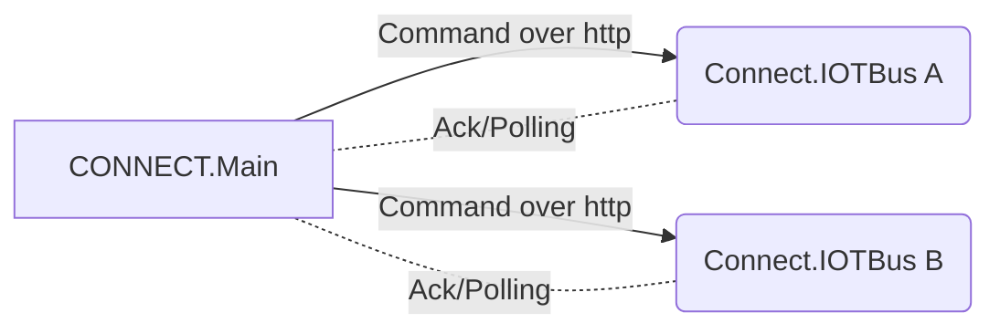
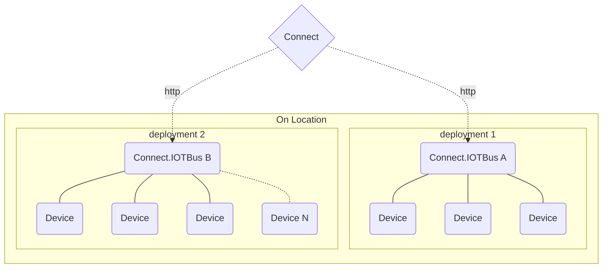

# IOT-Bus / Connect hardware

Speccing / Proof of concept for en IOT bus basert på Ikomm Connect core rettet mot IOT devices/Microcontrollere (som f.eks. Meadow, Pi Pico, \**Insert arduino flavor here*\*).  

## POC 
* Kan være f.eks. Hvordan kontrollere io pins på en microcontroller over Ikomm Connect.
* Api kommunikasjon FRA connect og ut til en kontroller?
* Egen "minified" Connect core bus designet for Connect IOT -stuff.

### IOT bus
- Egen IOT speccet Connect bus for styring av IOT devices ute hos kundelokasjon. 
- Med mulighet for overvåking av device health, oppdatering av firmware og direkte kontroll av enheter på lokasjon fra sentral Ikomm Connect Bus. 
- Kommandoer sendes fra Master Connect Gateway over til ekstern IOT bus ute hos kunde.
- Polling rate på devicer kan være fleksibelt fra device inn til IOT GW, men kommunikasjon fra IOT GW til Connect Main styres av Connect Main. 
- Én mulig POC kunne vert å skrive om deler av core til å kjøre på en meadow (Net standard 2.1), eller teste ut kommunikasjon mellom to forskjellige Connect Bus'er

