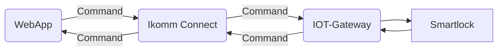

# What?
Be able to unlock a doorlock by interacting with Ikomm gateway.

```mermaid
graph LR
    F[WebApp] -->|Command| A(Ikomm Connect)
    A[Ikomm Connect] -->|Command| F(WebApp)
    A[Ikomm Connect] --> |Command| B(IOT-Gateway) --> C(Smartlock)
    C[Smartlock] --> B(IOT-Gateway) -->|Command| A(Ikomm Connect)
```
